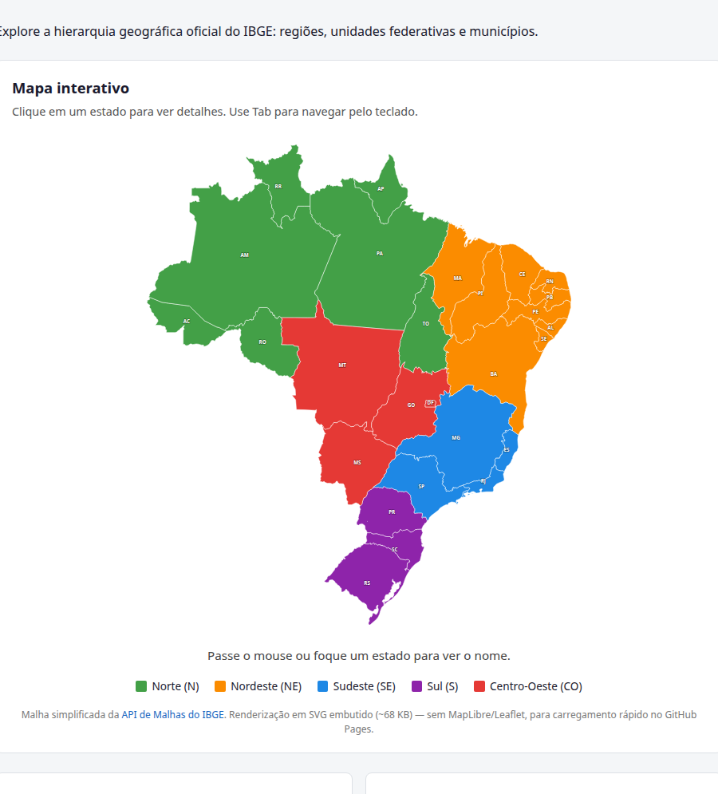
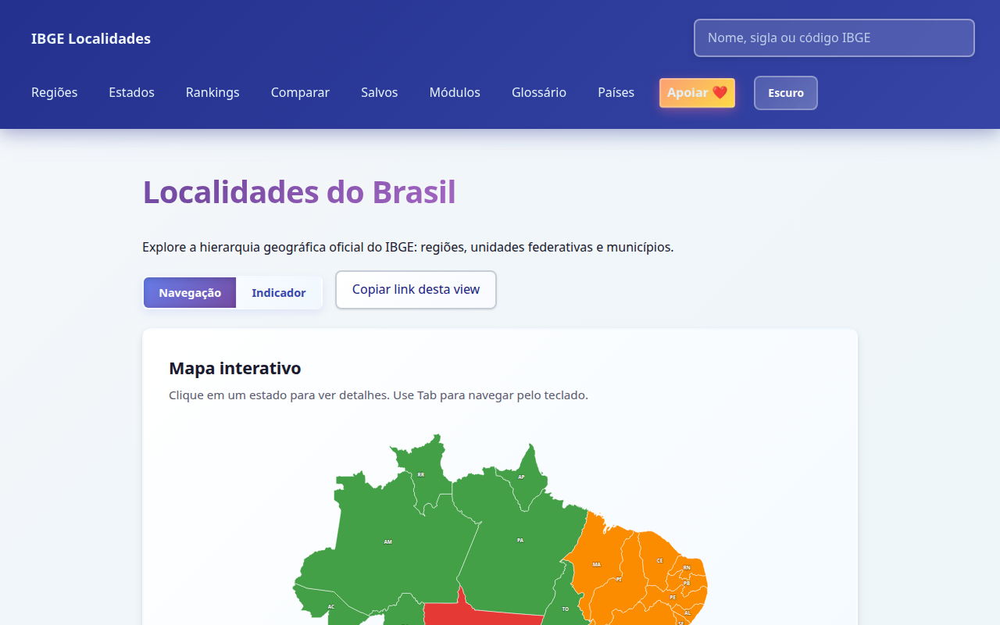
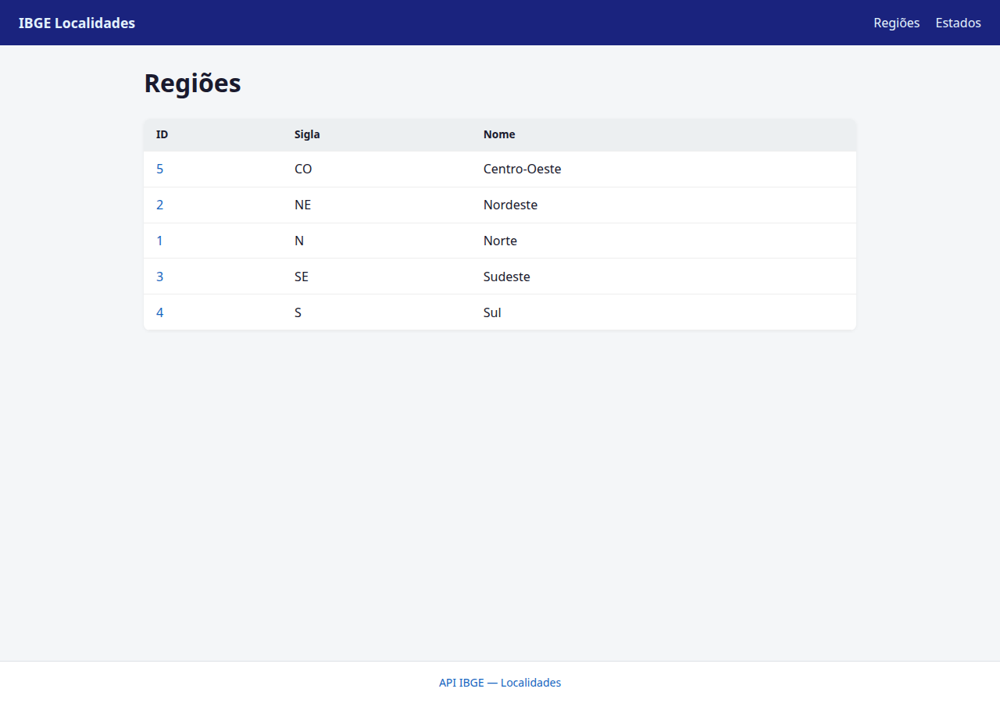
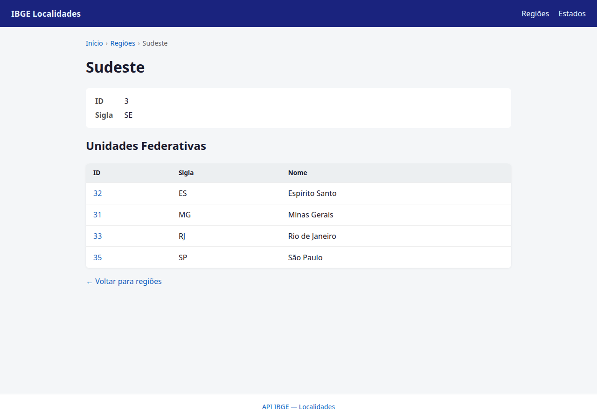
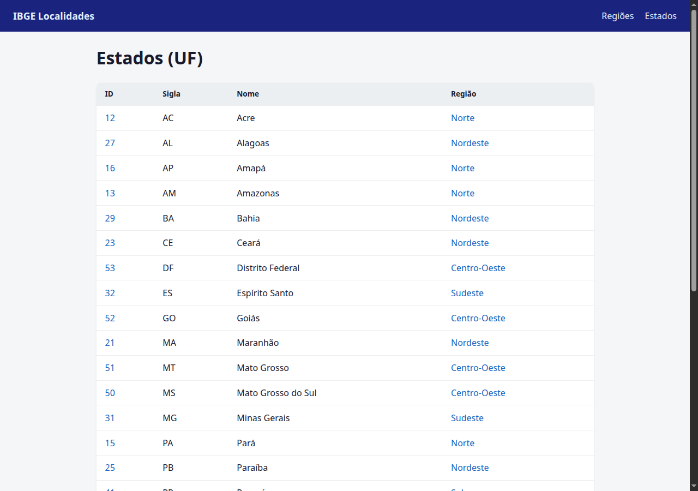
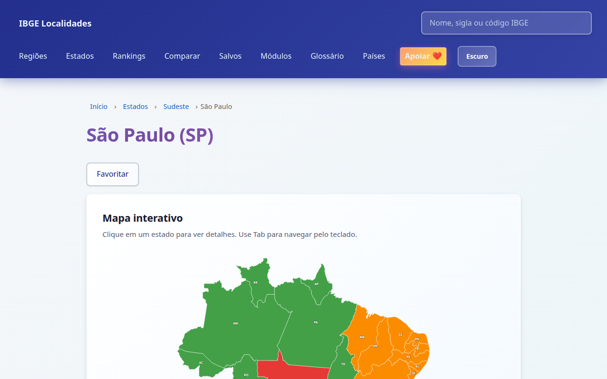
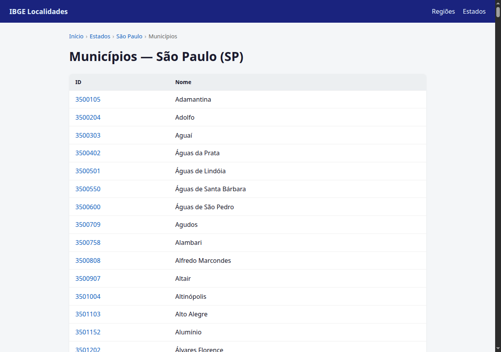
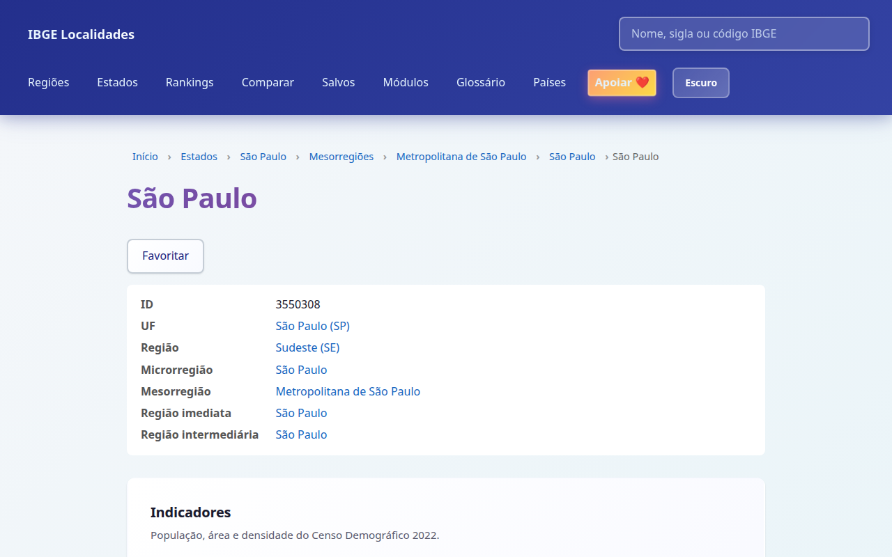

# IBGE Localidades

Frontend React (Vite + TypeScript) para consumir a [API de Localidades do IBGE](https://servicodados.ibge.gov.br/api/docs/localidades).

Hierarquia do MVP: **Regiões → UFs → Municípios**.

**Demo:** [tofariasti.github.io/ibge-localidades](https://tofariasti.github.io/ibge-localidades/)

## Telas

### Página inicial

Mapa interativo em SVG (malha simplificada do IBGE): clique em qualquer UF para ir ao detalhe do estado; a legenda leva às macrorregiões.





### Regiões





### Estados





### Municípios





## Pré-requisitos

- Node.js 20+
- npm
- Docker e Docker Compose (opcional)

## Desenvolvimento local

```bash
npm install
npm run dev
```

Acesse http://localhost:5173

## Docker

### Desenvolvimento (hot reload)

```bash
docker compose up
```

### Produção (build + nginx)

```bash
docker build -t ibge-localidades .
docker run -p 8080:80 ibge-localidades
```

Acesse http://localhost:8080

## GitHub Pages

A cada push na branch `main`, o workflow [`.github/workflows/deploy-pages.yml`](.github/workflows/deploy-pages.yml) publica o build em:

**https://tofariasti.github.io/ibge-localidades/**

### Configuração no repositório

Em **Settings → Pages → Build and deployment**, selecione **GitHub Actions** como fonte.

### Build local (mesmo ambiente do Pages)

```bash
npm run build:pages
npm run preview:pages
```

Acesse http://localhost:4173/ibge-localidades/

O build padrão (`npm run build`) continua com `base: /` para Docker e deploy em raiz.

## Rotas da aplicação

| Rota | Descrição |
|------|-----------|
| `/` | Página inicial com atalhos |
| `/regioes` | Lista das 5 macrorregiões |
| `/regioes/:id` | Detalhe da região e UFs associadas |
| `/estados` | Lista de todas as UFs |
| `/estados/:id` | Detalhe da UF |
| `/estados/:id/municipios` | Municípios da UF |
| `/estados/:id/mesorregioes` | Mesorregiões da UF |
| `/estados/:id/microrregioes` | Microrregiões da UF |
| `/estados/:id/regioes-intermediarias` | Regiões intermediárias da UF |
| `/estados/:id/regioes-imediatas` | Regiões imediatas da UF |
| `/mesorregioes/:id` | Detalhe da mesorregião e suas microrregiões |
| `/microrregioes/:id` | Detalhe da microrregião e seus municípios |
| `/regioes-intermediarias/:id` | Detalhe da intermediária e suas imediatas |
| `/regioes-imediatas/:id` | Detalhe da imediata e seus municípios |
| `/municipios/:id` | Detalhe do município |

## Exemplos de API (curl)

Base: `https://servicodados.ibge.gov.br/api/v1/localidades`

Nas telas do app, **Ver na API** / **Copiar URL da API** montam a mesma URL via `buildIbgeApiUrl` (`src/api/ibgeClient.ts`).

| Tela | Path típico |
|------|-------------|
| Lista de regiões | `/regioes?orderBy=nome` |
| Detalhe de região | `/regioes/{id}` |
| Lista de estados | `/estados?orderBy=nome` |
| Detalhe de estado | `/estados/{id}` |
| Municípios da UF | `/estados/{id}/municipios?orderBy=nome` |
| Mesorregiões da UF | `/estados/{id}/mesorregioes?orderBy=nome` |
| Detalhe de mesorregião | `/mesorregioes/{id}` |
| Microrregiões da UF | `/estados/{id}/microrregioes?orderBy=nome` |
| Microrregiões da meso | `/mesorregioes/{id}/microrregioes?orderBy=nome` |
| Detalhe de microrregião | `/microrregioes/{id}` |
| Municípios da micro | `/microrregioes/{id}/municipios?orderBy=nome` |
| Intermediárias da UF | `/estados/{id}/regioes-intermediarias?orderBy=nome` |
| Detalhe de intermediária | `/regioes-intermediarias/{id}` |
| Imediatas da intermediária | `/regioes-intermediarias/{id}/regioes-imediatas?orderBy=nome` |
| Imediatas da UF | `/estados/{id}/regioes-imediatas?orderBy=nome` |
| Detalhe de imediata | `/regioes-imediatas/{id}` |
| Municípios da imediata | `/regioes-imediatas/{id}/municipios?orderBy=nome` |
| Detalhe de município | `/municipios/{id}` |
| Todos os municípios (busca) | `/municipios?orderBy=nome` |

```bash
# Regiões
curl -s "https://servicodados.ibge.gov.br/api/v1/localidades/regioes?orderBy=nome"

# Região Sudeste e seus estados
curl -s "https://servicodados.ibge.gov.br/api/v1/localidades/regioes/3"
curl -s "https://servicodados.ibge.gov.br/api/v1/localidades/regioes/3/estados?orderBy=nome"

# Estado São Paulo, municípios, mesorregiões e microrregiões
curl -s "https://servicodados.ibge.gov.br/api/v1/localidades/estados/35"
curl -s "https://servicodados.ibge.gov.br/api/v1/localidades/estados/35/municipios?orderBy=nome"
curl -s "https://servicodados.ibge.gov.br/api/v1/localidades/estados/35/mesorregioes?orderBy=nome"
curl -s "https://servicodados.ibge.gov.br/api/v1/localidades/mesorregioes/3515/microrregioes?orderBy=nome"
curl -s "https://servicodados.ibge.gov.br/api/v1/localidades/microrregioes/35061/municipios?orderBy=nome"
curl -s "https://servicodados.ibge.gov.br/api/v1/localidades/estados/35/regioes-intermediarias?orderBy=nome"
curl -s "https://servicodados.ibge.gov.br/api/v1/localidades/regioes-intermediarias/3501/regioes-imediatas?orderBy=nome"
curl -s "https://servicodados.ibge.gov.br/api/v1/localidades/regioes-imediatas/350001/municipios?orderBy=nome"

# Município São Paulo (capital)
curl -s "https://servicodados.ibge.gov.br/api/v1/localidades/municipios/3550308"

# Todos os municípios (índice da busca global)
curl -s "https://servicodados.ibge.gov.br/api/v1/localidades/municipios?orderBy=nome" | head -c 200
```

## Funcionalidades (Fase 1)

- **Busca global** no header (nome, sigla UF ou código IBGE) com hierarquia no resultado
- **Filtro local** nas listas de regiões, estados e municípios, com contagem
- **Copiar** código IBGE / JSON nos detalhes; **exportar** CSV/JSON da lista filtrada
- **Ver / copiar URL** da API oficial correspondente à tela
## Scripts

| Comando | Descrição |
|---------|-----------|
| `npm run dev` | Servidor de desenvolvimento |
| `npm run build` | Build de produção (Docker / raiz) |
| `npm run build:pages` | Build para GitHub Pages |
| `npm run preview` | Preview do build |
| `npm run preview:pages` | Preview do build GitHub Pages |
| `npm run lint` | ESLint |
| `npm run generate:map` | Regenera `src/data/brazilMap.generated.json` via API de Malhas IBGE |

## Cache

Listagens estáveis (regiões, UFs, municípios por UF, UFs por região) usam cache em memória + `localStorage` (TTL 24h). Detalhes individuais sempre vão à API.

## Kanban e valor de produto

- Tarefas e user stories: [docs/KANBAN.md](docs/KANBAN.md)
- Prompt de discovery e priorização A/B/C: [docs/PRODUCT-VALUE.md](docs/PRODUCT-VALUE.md)

## Commits

Um commit por user story concluída (Conventional Commits). Histórico:

1. `chore: bootstrap projeto React, Docker e Kanban`
2. `feat: cliente API IBGE localidades com tipos TypeScript`
3. `feat: layout, rotas e componentes base de UI`
4. `feat: telas de regiões com listagem e detalhe`
5. `feat: telas de unidades federativas`
6. `feat: telas de municípios por UF e detalhe`
7. `docs: polimento UI e documentação de uso`
8. `feat: mapa interativo do Brasil (malha IBGE)`
9. `feat: cache, retry e empty state nas consultas IBGE`
10. `feat: busca global por nome, sigla e código IBGE`
11. `feat: filtro local e contagem nas listagens`
12. `feat: copiar e exportar CSV/JSON das consultas`
13. `feat: link e URL oficial da API IBGE nas telas`
14. `feat: mesorregiões e microrregiões com navegação cruzada`
15. `feat: regiões intermediárias e imediatas com navegação cruzada`
